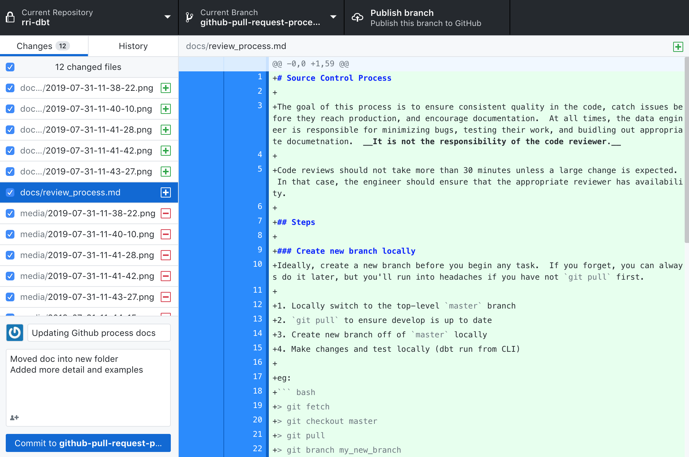
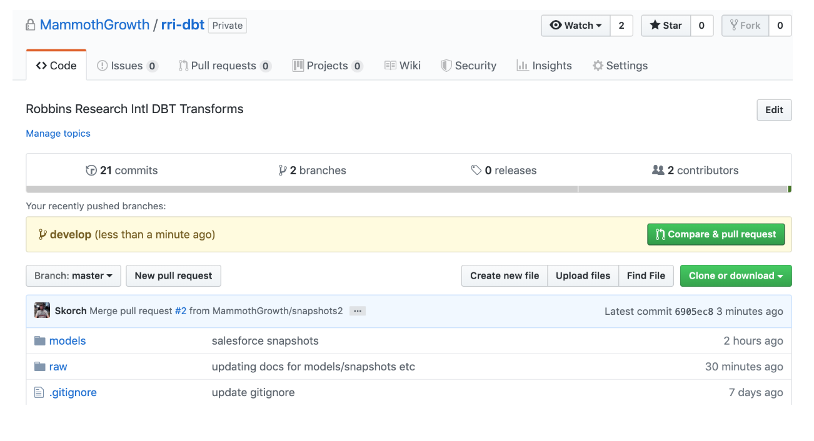
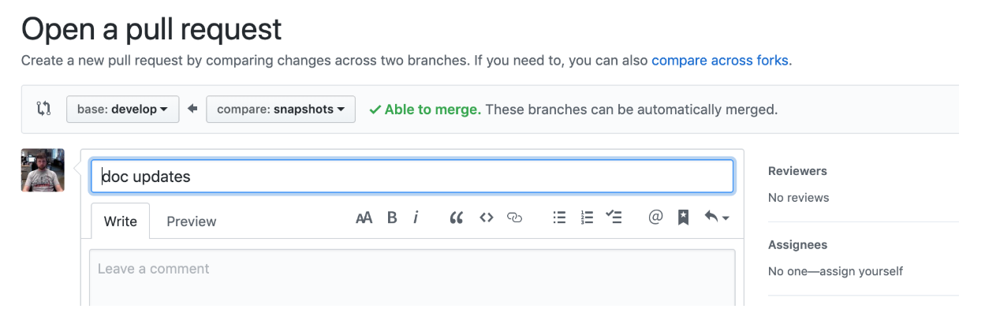
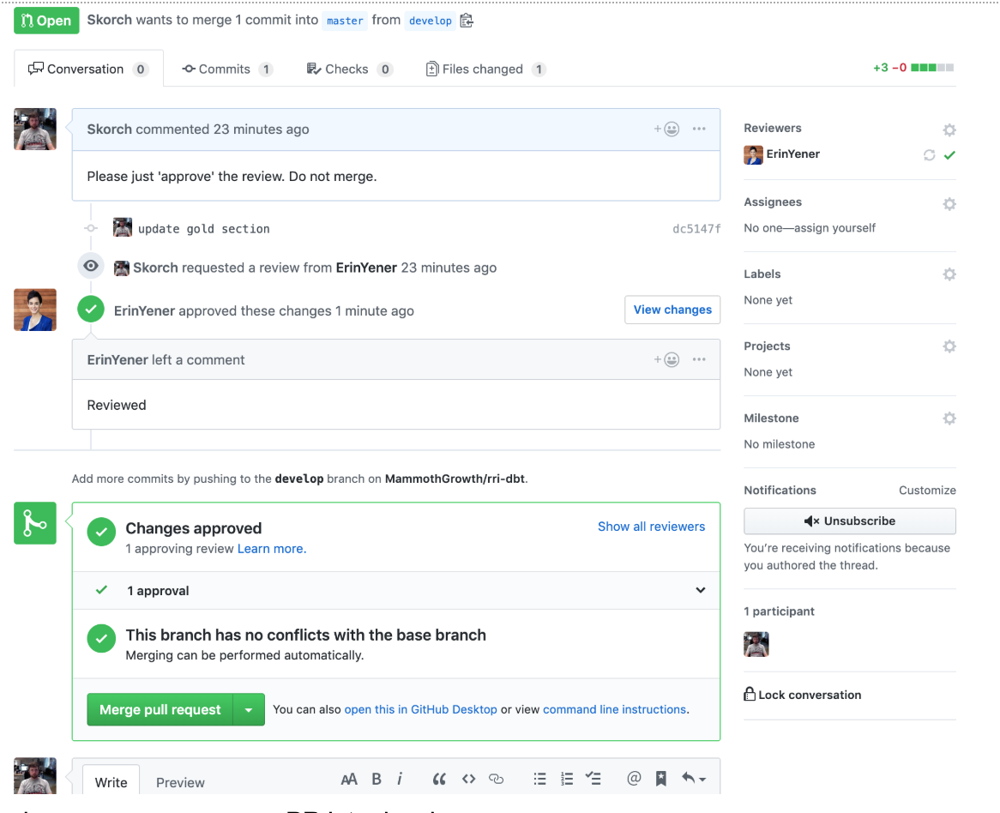
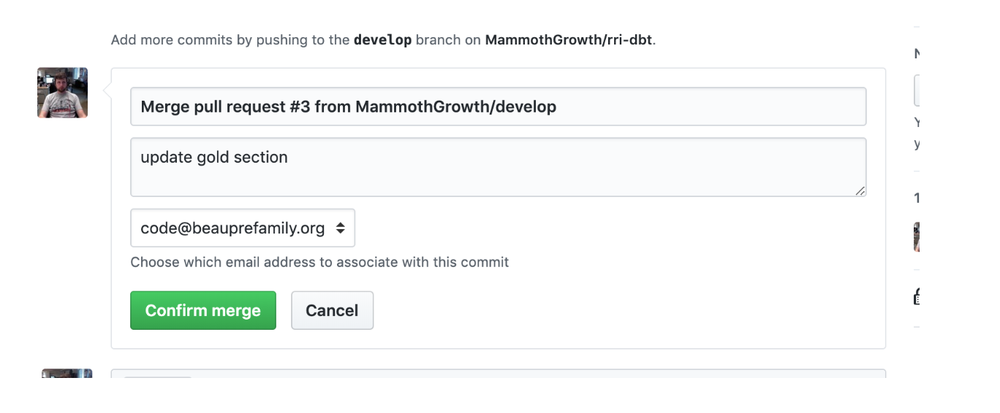
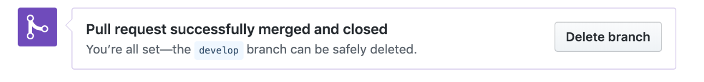

# Source Control Process

The goal of this process is to ensure consistent quality in the code, catch issues before they reach production, and encourage documentation.  At all times, the data engineer is responsible for minimizing bugs, testing their work, and buidling out appropriate documetnation.  __It is not the responsibility of the code reviewer.__

Code reviews should not take more than 30 minutes unless a large change is expected.  In that case, the engineer should ensure that the appropriate reviewer has availability.

## Required Reading / Reference

https://blog.getdbt.com/how-to-review-an-analytics-pull-request/

https://slack.engineering/on-empathy-pull-requests-979e4257d158


## Steps

### Create new branch locally
Ideally, create a new branch before you begin any task.  If you forget, you can always do it later, but you'll run into headaches if you have not `git pull` first.

1. Locally switch to the top-level `master` branch
2. `git pull` to ensure develop is up to date
3. Create new branch off of `master` locally
4. Make changes and test locally (dbt run from CLI)

eg:
``` bash
> git fetch
> git checkout master
> git pull
> git branch my_new_branch
> git checkout my_new_branch
```

[Github Desktop](https://desktop.github.com/) or similar app can also be used to manage this process.

### Commit your changes locally, and push to GitHub when ready
You are free to commit as often as you like and push to github as often as you like (within your own branch) as this will ensure that any changes are recoverable if you drop your laptop into the ocean by accident.

1. Commit to local branch
(using GUI tool since this process is a pain from the command line)


2. Push to `GitHub` (Origin)
Note, every app does this a bit differently.

#### Create pull request from web UI:
Pull Requests are central to code consistency.  This involves a review process and it also automates any external tasks/checks such as running the code in DBT.



#### Summarize the changes with a descriptive title

* Assign one or more reviewers
* Tag the reviewer in the comment with anything specific that they should look at
* In the comment / body, include any specific tests that were run or any points of complexity the reviewer should pay attention to
* Keep in mind that it is the engineer's job to ensure that everything is tested before the PR is created.

#### Watch the PR for approval and that all tasks have been successfully run


#### Merge into master

* Engineer is responsbile for merging the changes into `master`
* If there is a merge conflict, the engineer is responsible for resolving conflicts 

#### Delete development branch

* Keep things clean by removing the branch from github
* Optionally remove the branch from your local environment
* DBT will detect that the PR has been closed and remove the temporary sandbox schema and tables.

## All Done!
